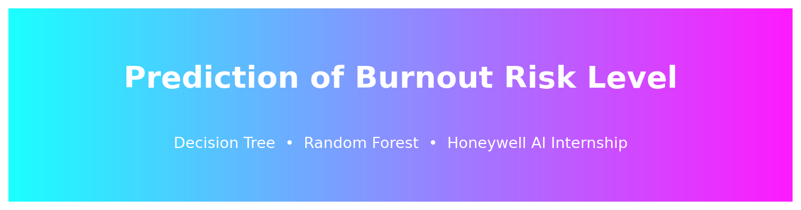

# 🧠 Prediction of Burnout Risk Level Using Decision Tree & Random Forest



> An end-to-end Machine Learning web application that predicts a student's **Burnout Risk Level** (Low / Medium / High) from academic performance, Generative AI usage patterns, and study habits — built during a **Honeywell AI Internship**.

[](https://www.python.org/)
[](https://streamlit.io/)
[](https://scikit-learn.org/)
[](LICENSE)
[](https://github.com/Sahilberwer)
[](https://linkedin.com/in/sandeep-berwer)

---

## 📖 Overview

This project predicts a student's **Burnout Risk Level** using their academic performance, Generative AI (GenAI) usage patterns, and traditional study habits. It compares a **Decision Tree** classifier against a **Random Forest** classifier, tunes both with `GridSearchCV`, and ships the winning model inside a full-featured, deployable **Streamlit** web application.

- **Dataset:** AI Student Impact Dataset — 50,000 student records, 16 columns
- **Target:** `Burnout_Risk_Level` (`Low` / `Medium` / `High`)
- **Final Model:** Random Forest Classifier

---

## ✨ Features

- 🎨 Modern glassmorphism UI with gradient theme, dark/light mode, and animated cards
- 🧭 Sidebar navigation across 5 pages: Home, Prediction, Model Performance, Visualizations, About
- 🎯 Auto-generated prediction form (sliders, selects, radio buttons, checkboxes) matching the dataset schema exactly
- 📊 Confidence score, per-class probability breakdown, color-coded risk banner, and tailored recommendations
- 🕒 In-session prediction history with CSV download and reset
- 📈 Full evaluation suite: accuracy, precision, recall, F1, ROC-AUC, confusion matrices, feature importance
- ⚡ Cached model/data loading for fast repeat interactions
- ☁️ Deploys as-is to Streamlit Community Cloud, Render, or HuggingFace Spaces

---

## 🔄 Project Workflow

```
Raw CSV (50,000 rows)
      │
      ▼
Data Cleaning  ──▶  Drop Student_ID, handle missing values
      │
      ▼
Encoding       ──▶  LabelEncoder on 6 categorical columns + target
      │
      ▼
EDA            ──▶  Correlation heatmap, class distribution
      │
      ▼
Train/Test Split (80/20, stratified)
      │
      ▼
Baseline Models ──▶ Decision Tree  +  Random Forest
      │
      ▼
GridSearchCV Tuning (3-fold CV) for both models
      │
      ▼
Evaluation      ──▶ Accuracy, Precision, Recall, F1, ROC-AUC, Confusion Matrix
      │
      ▼
Final Model: Random Forest  ──▶  Saved as model.pkl
      │
      ▼
Streamlit Web App (app.py)
```

---

## 📊 Dataset

**AI Student Impact Dataset** — `ai_student_impact_dataset.csv` (50,000 rows × 16 columns)

| Column | Type | Description |
|---|---|---|
| Student_ID | int | Unique identifier (dropped before modeling) |
| Major_Category | categorical | Arts, Business, Humanities, Medical, STEM |
| Year_of_Study | categorical | Freshman → Graduate |
| Pre_Semester_GPA | numeric | GPA before the semester (0–4) |
| Weekly_GenAI_Hours | numeric | Weekly hours using GenAI tools |
| Primary_Use_Case | categorical | Main way the student uses GenAI |
| Prompt_Engineering_Skill | categorical | Beginner / Intermediate / Advanced |
| Tool_Diversity | numeric | Number of distinct AI tools used (1–5) |
| Paid_Subscription | boolean | Has a paid AI subscription |
| Traditional_Study_Hours | numeric | Weekly unassisted study hours |
| Perceived_AI_Dependency | numeric | Self-rated AI dependency (1–10) |
| Institutional_Policy | categorical | Institution's GenAI policy |
| Anxiety_Level_During_Exams | numeric | Self-rated exam anxiety (1–10) |
| Post_Semester_GPA | numeric | GPA after the semester (0–4) |
| Skill_Retention_Score | numeric | Skill retention score (0–100) |
| **Burnout_Risk_Level** | **target** | **Low / Medium / High** |

---

## 🤖 Model & Results

Both models were tuned with `GridSearchCV` (3-fold cross-validation, `scoring="accuracy"`) on an 80/20 stratified train/test split of the 50,000-row dataset.

**Best Hyperparameters**

| Model | Best Parameters |
|---|---|
| Decision Tree | `criterion=entropy, max_depth=6, min_samples_leaf=4, min_samples_split=2` |
| Random Forest | `n_estimators=100, max_depth=10, min_samples_leaf=1, min_samples_split=5` |

**Test Set Performance (tuned models)**

| Metric | Decision Tree | Random Forest |
|---|---|---|
| Accuracy | 0.522 | **0.528** |
| Precision | 0.533 | **0.547** |
| Recall | 0.522 | **0.528** |
| F1 Score | 0.523 | **0.525** |
| ROC-AUC (weighted, OvR) | 0.682 | **0.690** |

> Random Forest was selected as the final model because it consistently outperformed the single Decision Tree across every metric, and its ensemble averaging reduces overfitting on this large, noisy real-world-style dataset.

Full metrics, confusion matrices, and a 5-fold cross-validation score are generated by `train_model.py` and saved to `artifacts/metrics.json`.

**Most influential features** (from Random Forest feature importance): Anxiety Level During Exams, Weekly GenAI Hours, Traditional Study Hours, Perceived AI Dependency, and Skill Retention Score.

---

## 🖼️ Screenshots

> Screenshots of the running app should be added here after your first local run or deployment (see `screenshots/` folder). Run the app locally, take screenshots of the Home, Prediction, and Visualizations pages, and drop them into `screenshots/home.png`, `screenshots/prediction.png`, and `screenshots/dashboard.png`.

| Home | Prediction | Dashboard |
|---|---|---|
| `screenshots/home.png` | `screenshots/prediction.png` | `screenshots/dashboard.png` |

---

## 🛠️ Installation & How to Run

### 1. Clone the repository
```bash
git clone https://github.com/Sahilberwer/burnout-risk-prediction.git
cd burnout-risk-prediction
```

### 2. Install dependencies
```bash
pip install -r requirements.txt
```

### 3. Train the model
This reads `ai_student_impact_dataset.csv`, runs the full pipeline (cleaning → encoding → training → GridSearchCV tuning → evaluation), and saves everything into `artifacts/`.
```bash
python train_model.py
```

### 4. Run the app
```bash
streamlit run app.py
```

The app will open at `http://localhost:8501`.

> No manual editing is required. No placeholder code. Everything is fully implemented and runs with just these three commands.

---

## ☁️ Deployment

This app deploys without code changes on:

### Streamlit Community Cloud
1. Push this repo to GitHub.
2. Go to [share.streamlit.io](https://share.streamlit.io), connect your repo, set the main file to `app.py`.
3. Streamlit Cloud installs `requirements.txt` automatically. Make sure `train_model.py` has been run at least once and `artifacts/` (including `model.pkl`) is committed to the repo, since Community Cloud does not run training scripts automatically.

### Render
1. Create a new **Web Service**, connect this repo.
2. Render reads `Procfile` and `runtime.txt` automatically.
3. Build command: `pip install -r requirements.txt`
4. Start command is already defined in `Procfile`.

### HuggingFace Spaces
1. Create a new Space → SDK: **Streamlit**.
2. Upload all files (or push via git) — Spaces will auto-detect `app.py` and `requirements.txt`.

---

## 📁 Folder Structure

```
burnout-risk-prediction/
├── app.py                     # Main Streamlit application
├── train_model.py             # Full training pipeline (cleaning → tuning → saving)
├── predict.py                 # Inference logic used by the app
├── preprocessing.py           # Shared preprocessing utilities & feature metadata
├── utils.py                   # Streamlit caching, custom CSS, footer helpers
├── ai_student_impact_dataset.csv
├── requirements.txt
├── runtime.txt
├── Procfile
├── README.md
├── LICENSE
├── .gitignore
├── artifacts/                 # Generated by train_model.py
│   ├── model.pkl
│   ├── encoder.pkl
│   ├── feature_columns.pkl
│   ├── metrics.json
│   ├── feature_importance.json
│   └── *.png                  # confusion matrices, ROC curve, heatmap, etc.
├── assets/
│   ├── logo.png
│   ├── banner.png
│   └── background.png
└── screenshots/
    ├── home.png
    ├── prediction.png
    └── dashboard.png
```

---

## 🔮 Future Scope

- Incorporate longitudinal (multi-semester) data to track burnout trends over time
- Add SHAP-based explainability for individual predictions
- Integrate with institutional LMS platforms for automated early-warning alerts
- Experiment with gradient boosting models (XGBoost / LightGBM) for further accuracy gains

---

## 📜 License

This project is licensed under the [MIT License](LICENSE).

---

## 👤 Author

**Sandeep**
B.Tech CSE (AI & ML), Guru Jambheshwar University of Science and Technology (GJU&ST), Hisar
Developed as part of the **Honeywell AI Internship**

[](https://github.com/Sahilberwer)
[](https://linkedin.com/in/sandeep-berwer)
